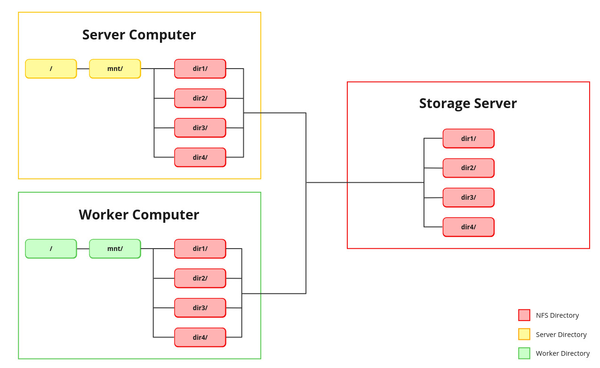

# Polar Pipeline
is a pipeline for the purpose of analyzing human genomic data.

## Table of Contents

- [Introduction](#introduction)
- [Key Components](#key-components)
- [Features](#features)
- [Installation](#installation)
- [Usage](#usage)
- [Contributing](#contributing)
- [License](#license)

## Introduction

The Polar Pipeline is a powerful Flask-based web application and pipeline tailored for the seamless execution of genomic data analysis pipelines. It is meticulously designed to provide efficient and user-friendly access to advanced genomic research tools. Some features like changing what VEP plugins are included are not part of this program, so changing these will require modification of source code. It is designed and ran on Ubuntu 22.04, but will likely work on other versions.

## Key Components

- **Webapp:** A user friendly frontend for file organization, data processing, task handling, and minor analysis. The application is hosted through Flask.

- **SQL Server**: The Polar Pipeline utilizes PostgreSQL to manage the status of all ongoing jobs, as well as store information about completed runs and the subsequent output files.

- **Task Queueing**: Utilizing the RabbitMQ message broker and the Celery job queue, the application efficiently manages and schedules data analysis jobs, allowing for parallel processing and optimal resource utilization.

## Features

#### User-friendly Interface
- An accessible and intuitive interface allows users to submit and monitor genomic data analysis tasks with ease.

#### Data Processing and Analysis:
- The Polar Pipeline simplifies the complex process of analyzing human genomic data, making it accessible to researchers and scientists with varying levels of expertise.
- With Celery's job queuing system, the Polar Pipeline scales to handle simultaneous computations across multiple computers, automatically distributing the workload without the use of clusters.
- The output of this pipeline, while still including all individual output files, will utilize information from Snipeff, Sniffles2, and the ensemble Variant Effect Predictor to create a singular file with all the information from the aforementioned programs in one place.

#### Data Management
- In the event that patient information is being handled, the Polar Pipeline offers a tool to deidentify and reidentify patient IDs, using a custom drag-and-drop style interface.
- The Polar Pipeline includes a search feature, which will allow a user to automatically find any variants within the Polar Pipeline output meeting a list of specified criteria, making previously processed data more accessible. Additionally, a separate page provides a way to search files not produced by the Pipeline, allowing files from other sources to be more easily filtered.

#### Reporting
- Upon providing a variant ID on the Report Generator page, the Polar Pipeline can produce a paragraph detailing the predicted effects of a specific variant, the protein consequence, as well as any known phenotypes as detailed by ClinVar.
- Included is a tool to generate HGVS IDs for all variants (including structural variants), providing a way to refer to specific variants unambiguously.
- The Polar Pipeline features a protein figure generator for displaying locations of variants on genes. Supports heterozygous and homozygous proteins, as well as heterozygous proteins with varying structures.

#### Customization and Configuration
- The output of the pipeline can be configured on a run-to-run basis, so the output can be sent different places according to the user's preference.
- In the event that computers connected to the pipeline have differing levels of processing power, the threads for each computer can be set manually.


## Installation
##### Polar Pipeline setup:
This pipeline was developed and tested on Ubuntu. Other debian-based distros should work, such as Mint, but they are similarly untested. As it is in a Docker container, it may be possible to host the application on a Windows host, but in depth knowledge will be required to set up.
1. Install Docker on the to-be host machine.

2. Download the repository to the host machine.

3. In the server's ```.../polar-pipeline/mnt/```, establish new directories for both input and output locations. Utilize NFS or symbolic links to grant accessibility to these locations from the server's ```mnt/``` directory, which might necessitate the installation of ```nfs-server``` and ```nfs-common```. Ensure replication of this directory structure, including NFS and symbolic links, within all workers' ```/mnt/``` directory. Refer to the provided directory structure diagram for clarity. 

4. Inside ```.../polar-pipeline/services/web/polarpipeline/resources/```, rename the file ```config.ini.example``` to ```config.ini```.

5. Run ```sudo docker compose up -d``` in the repository directory. (the directory containing docker-compose.yaml)

6. The Polar Pipeline will build and begin hosting. The site on the host machine is accessible at ```localhost:5000```. Other machines on the same network will use the local ip of the host rather than ```localhost```. The local IP is visible by running ```hostname -I | awk '{print $1}'``` on the host machine.

7. In the configuration, set the output directories as viewed by the workers, the host IP, thread counts for workers, and upload reference, gene source files, bed files, etc.

8. Create worker machines following the instructions in the setup page on the Polar Pipeline website.

##### Report Generator setup:
1. Install vep, putting the ```ensembl-vep```, ```.vep```, and ```vep-resources``` folders inside ```.../polar-pipeline-docker/services/web/vep``` along with a ```GCA_000001405.15_GRCh38_no_alt_analysis_set.fasta``` and index file.

## Usage
1. Place fastq, fastq.gz, or .bam files to be processed somewhere that is accessible from the Polar Pipeline's ```mnt/``` directory.
2. Go to the configuration tab on the Polar Pipeline website, and upload needed reference files, clair models, bed files, and gene source files.
3. Navigate to the processing page of the Polar Pipeline website and select the file to be processed.
4. Make selections, including what type of sample, a bed file to intersect with, etc.
5. Hit start, and head to the dashboard tab to view progress.
6. Output will be as defined in the configuration tab, under the "General" dropdown. This is in reference to the worker computers, not the host.

## Contribution
Even though the programs are not included in this repository, the following tools are necessary for the usage of the Polar Pipeline.
- [Minimap2](https://github.com/lh3/minimap2)
- [Nextflow](https://www.nextflow.io/)
- [epi2me-labs/wf-human-variation](https://github.com/epi2me-labs/wf-human-variation)
- [samtools](http://www.htslib.org/)
- [bedtools](https://bedtools.readthedocs.io/en/latest/)
- [Varient Effect Predictor](https://ensembl.org/vep)

#### How to Contribute
1. **Bug Reports:** If you encounter any bugs or issues while using the Polar Pipeline, please consider opening an issue on our GitHub repository to document the problem. While fixes may not be actively implemented, this can help other users who encounter similar issues in the future.
2. **Pull Requests:** While I may not regularly review or merge pull requests, you're welcome to submit them if you've made improvements or modifications to the Polar Pipeline that you'd like to share.

#### Contributing Code
1. Fork the repository and create a new branch for your modifications or enhancements.
2. Make your changes, ensuring that they align with the project's goals and objectives.
3. Submit a pull request with your changes, providing a brief description of the modifications you've made.

I appreciate any contributions made to the Polar Pipeline project, whether it's reporting issues or submitting code changes. Thank you for your interest in the project!

## License
This project is licensed under the terms of the MIT License. See the [LICENSE](LICENSE.md) file for the full license text.
